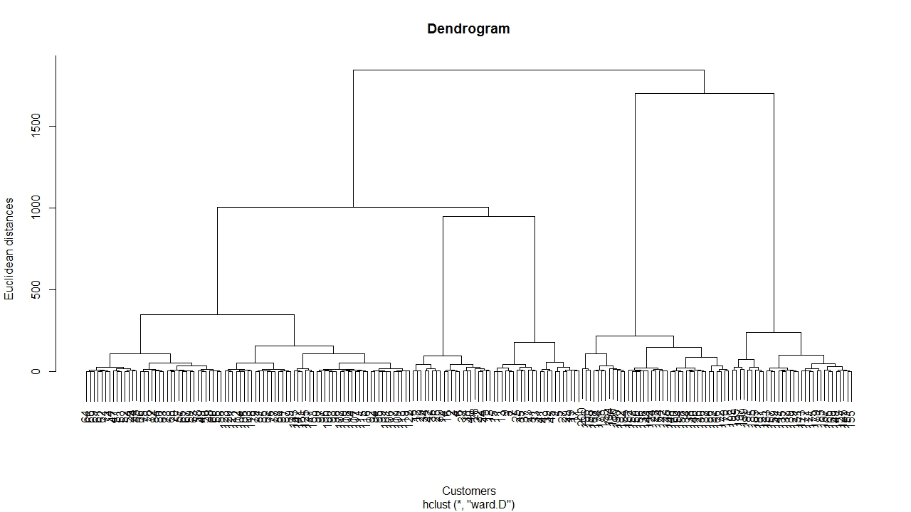
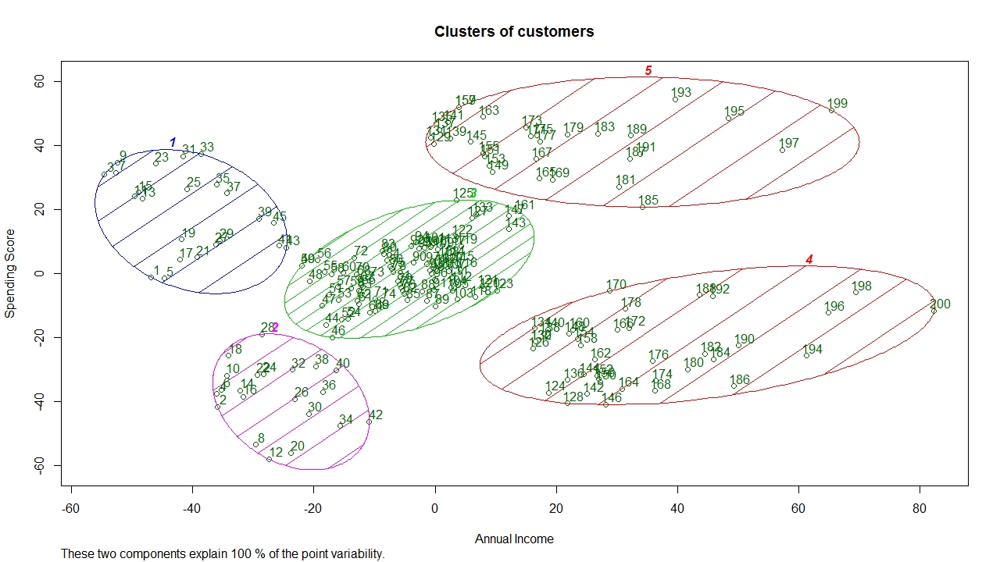

# Hierarchical Clustering   

#### Clustering is the process of grouping together certain variables on the bases of their similarities

## Business Problem
#### The provided dataset was for a Shopping Mall and contained information about its customers. The dataset contains a column called ‘Spending Score’. This column indicates how much money the customer spends in the Mall. The range of the score is from 1 to 100, with 1 being the lowest, and 100 being the highest. The task was to group the customers into clusters based on their Income and Spending Scores so that ads can be diverted to the highest spending group so that the Mall makes a higher profit.

## Model
#### Hierarchical Clustering was used to solve this problem. It found five distinct groups in the dataset.

## Visualization
### Dendrogram
#### They are used to determine the number of clusters in data. The plot used in this problem to find the number of clusters can be seen below.

### Clusters

## Other Model
#### This problem can be solved with K-Means Clustering as well. The link for that solution is below.
#### K-Means Clustering : https://github.com/PranavBhandari97/Machine-Learning-Algorithms/tree/main/Clustering/K-Means%20Clustering
