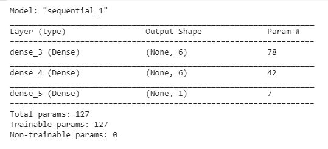

# Artificial Neural Network(ANN)

## Business Problem
#### The provided dataset contained information for customers of a bank. The bank wanted us to predict if a customer will leave the bank and go or no.

## Model
#### The designed model contained 11 nodes in the input layer, followed by 6 nodes each in the first and second hidden layer. The output layer contained a single node.
#### The ‘relu’ activation function was used for the input and the hidden layers and ‘sigmoid’ was used for the output layer.
#### The ‘adam’ optimiser was used when compiling the model with the ‘accuracy’ metric and ‘binary_crossentropy’ loss.
#### The model was trained with a batch size of 32 and 100 epochs.

## Model Summary

## Accuracy
#### Python : 86.71%
#### R : 86.55%
