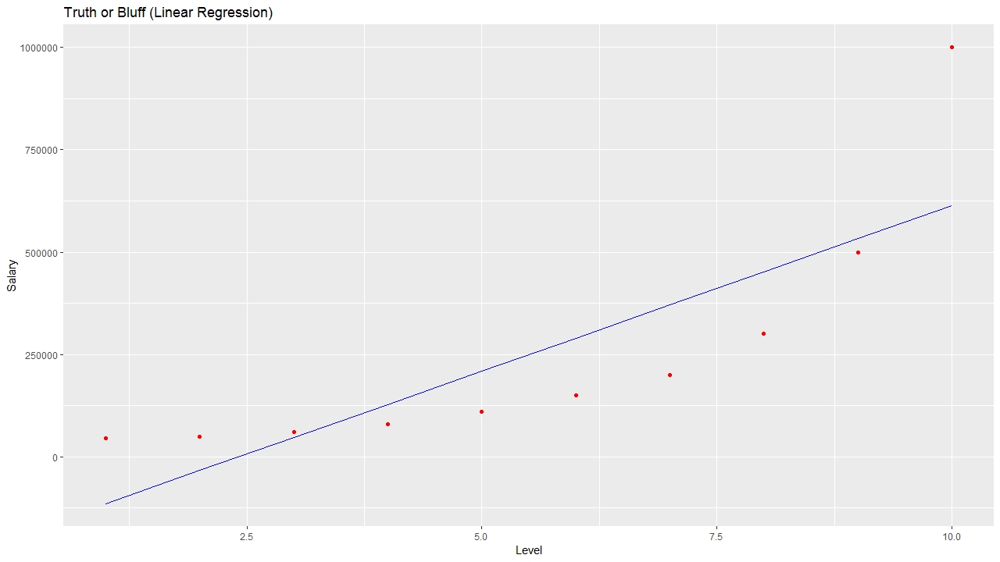
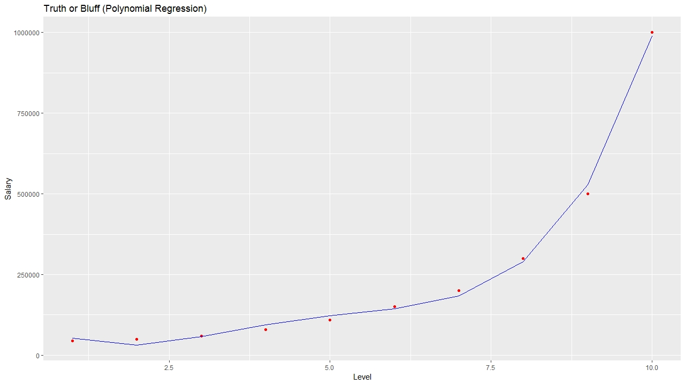

# Polynomial Regression

## Business Problem
#### The dataset contained information regarding years of experience and salary earned. The aim was to design a regression model to see if the predicted and actual salary match each other. The actual salary for an experience of 6.5 years was $160000. The model needed to predict a value as close to this as possible.

## Model
#### Polynomial Regression was implemented to try and solve this problem. It was implemented in both Python and R. Salary predicted using models in both languages can be seen below.

## Prediction
#### Python: 158862.45
#### R: 158862.5

## Visualization
#### The visualizations below was built in R. The plots in Python can be found in the notebook.

#### Linear Regression (For Comparison)

#### Polynomial Regression (Basic Plot)

#### Polynomial Regression ( Smoother plot)
.jpeg)

## Other Models
#### Other models like Decision Tree, Random Forest and Support Vector Regression (SVR) were used as well to solve this problem. The table below shows their predictions in both languages.

## Predictions of other models
| Model | Python | R |
| --- | --- | --- |
| Decision Tree | 150000 | 250000 |
| Random Forest | 160333.33 | 161990.8 |
|SVR | 170370.02 | 177861.1 |

## Links to other models
#### Decision Tree: https://github.com/PranavBhandari97/Machine-Learning-Algorithms/tree/main/Regression/Decision%20Tree%20Regression
#### Random Forest: https://github.com/PranavBhandari97/Machine-Learning-Algorithms/tree/main/Regression/Random%20Forest%20Regression
#### SVR : https://github.com/PranavBhandari97/Machine-Learning-Algorithms/tree/main/Regression/Support%20Vector%20Regression(SVR)
