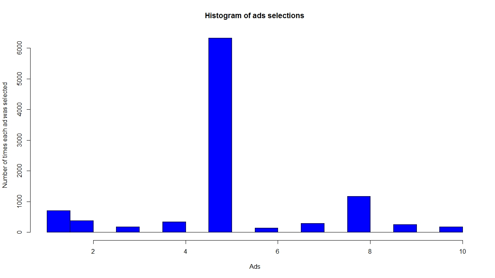

# Upper Confidence Bound (UBC)
#### UBC is a Reinforcement Learning(RL) Algorithm. RL is an area of Machine Learning concerned with how an algorithm behaves in an environment to earn maximum rewards.

## Business Problem
#### The given dataset contains information about 10 ads. It had the results as well as to what ads were liked the most. An algorithm needed to be used which could explore as well as exploit the dataset at the same time to get the maximum rewards. A/B testing could be used, however, it would only explore the dataset, thus wasting our resources to a certain extend. So, an RL algorithm needs to be used.

## Model
#### UBC was used to solve this problem. The rewards produced by it in Python, as well as R, can be seen below.
#### The higher the reward, the better is the model’s performance.
#### Python: 2178
#### R: 2178

## Visualization
#### The visual generated in R can be seen below. The visual for Python can be found in the notebook.

## Other Model
#### This problem can be solved using Thompson Sampling as well. Thompson Sampling is another RL algorithm. The rewards produced in Thompson Sampling can be seen below.
#### Python: 2606
#### R: 2595
#### Thompson Sampling: https://github.com/PranavBhandari97/Machine-Learning-Algorithms/tree/main/Reinforcement%20Learning/Thompson%20Sampling
